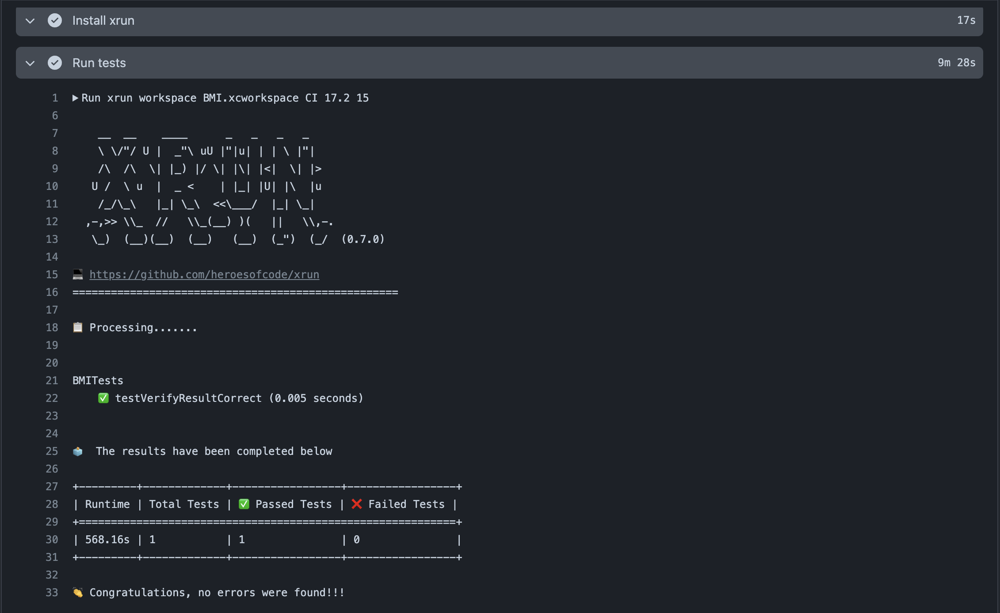

It works on any CI, here I'll bring an example on GitHub Action for you to add to your iOS or macOS project

```yaml
- name: Install xrun
  run: |
      brew tap heroesofcode/taps
      brew install heroesofcode/taps/xrun

- name: Run tests with xrun
  run: xrun project DeliveryApp.xcodeproj DeliveryApp 17.5 15 fail
```

### Example


