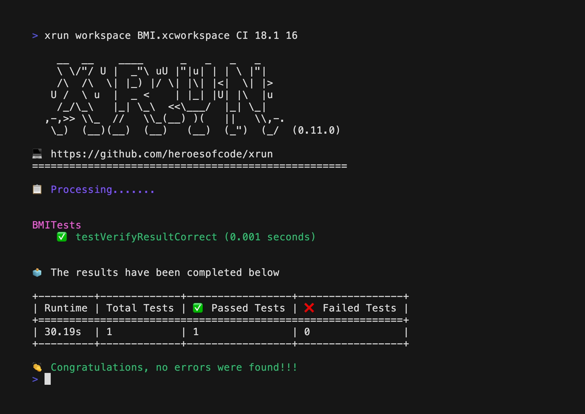

    

Command-line tools for macOS. With xrun you can run iOS and macOS unit tests through the terminal or CI with more ease and reading.

- Shows the tests that were executed most easily.
- Shows a table with test information.
- If there is an error, it shows a table with failed tests.
- It can run in the terminal and in a CI.
- Support for iOS and macOS.
- Generate PDF of failed tests.

